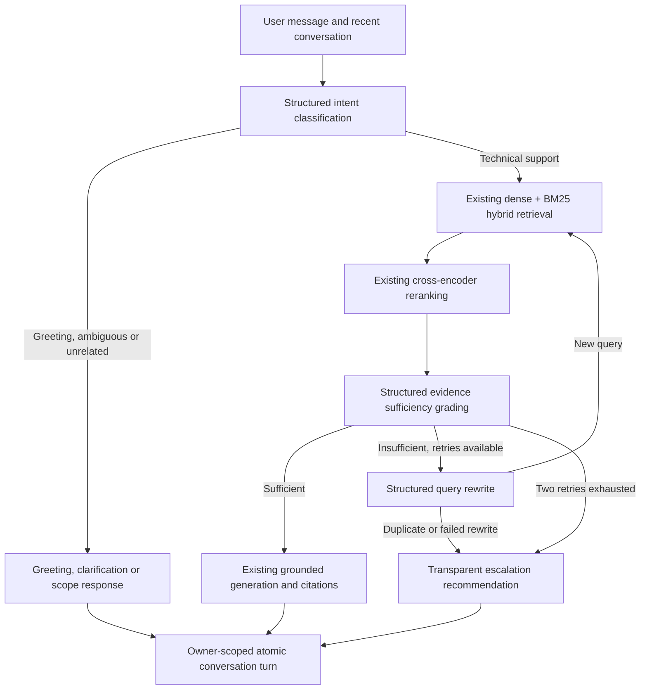

# ai-technical-support-agentic-rag
An end-to-end AI Technical Support Resolution Assistant powered by Agentic RAG, hybrid retrieval, reranking, and query correction to deliver accurate, context-aware, and grounded solutions from multi-format technical knowledge sources.

The backend now includes a LangGraph workflow, authenticated chat, and MongoDB conversations.
The existing authentication endpoints and Traditional RAG function remain available.
A React frontend in `frontend/` integrates with the existing authentication, chat,
and conversation APIs. Deployment and support-ticket creation are not included.

## Run the backend

Use the existing Conda environment `python_311` (Python 3.11.17). Do not create a
new environment. Its interpreter is
`C:\Users\sri charan\anaconda3\envs\python_311\python.exe`.

From the repository root in PowerShell:

```powershell
conda activate python_311
python -B -m pip check
# If backend/.env does not exist, copy backend/.env.example and supply real values.
# Keep an existing backend/.env; new optional settings already have defaults.
Set-Location backend
python -B -m uvicorn app.main:app --reload
```

If Conda activation is unavailable in the shell, invoke that interpreter directly:

```powershell
Set-Location backend
& 'C:\Users\sri charan\anaconda3\envs\python_311\python.exe' -B -m uvicorn app.main:app --reload
```

All runtime requirements were already installed in this environment. Only the
missing `watchfiles`, `pytest`, `pytest-asyncio`, `iniconfig`, and `pluggy` packages
were installed for reload support and testing. No existing packages were upgraded.
If these additions are missing on another machine with the same environment,
install only those missing packages with its own Python executable; do not
recreate the environment.

Open `http://localhost:8000/docs`. Existing routes are `GET /health`,
`POST /auth/register`, `POST /auth/login`, and `GET /auth/me`.
Authentication still uses the existing bearer JWT and current-user dependency.

MongoDB must be reachable at startup. A compound conversation owner/update-time
index is created using the existing `technical_support_db` connection. ML models,
Pinecone verification, BM25, and the graph initialize lazily in a worker on first
chat, once per process. This avoids making authentication startup depend on
model downloads or Pinecone availability. First chat can be slow while models load.
Use one API worker initially: multiple workers each hold their own ML models.

## Backend structure

```text
backend/
├── .env.example
├── requirements.txt
├── requirements-test.txt
├── pytest.ini
├── app/
│   ├── main.py
│   ├── core/                 # Existing configuration, security, dependencies, logs
│   ├── db/                   # Existing async MongoDB connection
│   ├── routers/
│   │   ├── auth.py           # Existing registration/login/me
│   │   └── rag.py            # Chat and conversation endpoints
│   ├── schemas/
│   │   ├── user.py
│   │   └── rag.py
│   ├── services/
│   │   ├── auth_service.py
│   │   ├── agentic_rag_service.py
│   │   ├── conversation_service.py
│   │   └── rag_resources.py
│   └── rag/
│       ├── agentic/
│       │   ├── state.py
│       │   ├── nodes.py
│       │   ├── graph.py
│       │   └── policies.py
│       ├── corpus.py
│       ├── ingestion/        # Existing components plus build_corpus.py
│       ├── embeddings/       # Existing components
│       ├── vectorstore/      # Existing components
│       ├── retrieval/        # Existing components
│       ├── generation/       # Existing pipeline; shared, bounded Groq client
│       └── evaluation/       # Existing metrics and generation reference questions
├── notebooks/
│   └── retrieval_evaluation_data.json
└── tests/
    ├── conftest.py
    ├── fakes.py
    ├── test_agentic.py
    ├── test_api.py
    └── test_resources_and_traditional.py
```

## Agentic workflow



Intent, evidence and rewrite outputs use Pydantic schemas through Groq structured
function calling. Failed intent classification requests clarification. Failed
evidence grading never permits generation. Document similarity is not treated as
proof of correctness. Generation retains the existing context builder, grounded
prompt and numbered sources; missing/unknown citation identifiers are rejected.
Citation existence does not independently prove factual support for every claim.

At most three retrieval attempts occur: the original search and two rewritten
searches. Previously attempted queries are compared after case/whitespace/basic
terminal punctuation normalization. A failed/duplicate rewrite terminates.
A recursion limit provides an additional graph execution bound.

The latest three conversation turns, bounded in length, are provided only for
intent/reference resolution. Generation receives a standalone question and retrieved
documents, not historical answers as evidence. History is untrusted and cannot
replace the knowledge-base prompt. This is basic conversational context, not a
durable LangGraph checkpoint system. Raw graph state and grading reasoning are
not stored or exposed. Existing LLM evaluation helpers remain available offline.

## Canonical knowledge corpus

The checked-in `backend/notebooks/retrieval_evaluation_data.json` contains 43
persisted text/metadata chunks and is the default BM25 snapshot. Its evaluation
queries are ignored by initialization. Every chunk ID is checked against the
existing chunker's deterministic identity algorithm.

Before serving RAG, initialization verifies the Pinecone index dimension (384),
the `nexadesk-kb` namespace count, and every chunk's ID, text and citation metadata.
The snapshot is authoritative only when it passes this verification. A mismatch
returns a sanitized HTTP 503; there is no empty-corpus or dense-only fallback.
No Azure download or vector upsert occurs during API startup or chat initialization.

If the Pinecone knowledge base has changed, generate a matching full snapshot
using the existing ingestion components. From `backend/`:

```powershell
python -m app.rag.ingestion.build_corpus --output data/kb_chunks.json
```

This explicit command downloads supported Azure blobs, loads/cleans/chunks them,
validates IDs and writes a versioned JSON snapshot atomically. It does not change
Pinecone. Set `RAG_CORPUS_PATH=data/kb_chunks.json` and restart the backend.
The generated data directory is gitignored because it can contain support data.

Only when intentionally updating the existing knowledge base:

```powershell
python -m app.rag.ingestion.build_corpus --output data/kb_chunks.json --upsert
```

This upserts embeddings into the existing namespace. It never deletes stale
vectors or creates an index. If old vectors remain after source changes, reconcile
the namespace separately before chat initialization can pass its exact membership
check. Pinecone changes may require time to become visible. Back up an existing
snapshot before intentionally replacing it. The original PDF and DOCX loaders use
text extraction; scanned PDFs and DOCX tables do not gain OCR/table support here.

## Chat and conversations

All new endpoints require `Authorization: Bearer <access_token>`.

| Endpoint | Behavior |
|---|---|
| `POST /rag/chat` | Create a conversation or append to an owned conversation |
| `GET /rag/conversations?limit=20&offset=0` | List only the authenticated user's conversations |
| `GET /rag/conversations/{id}?limit=20&offset=0` | Read owned history, paginated by turns |

Obtain a token from the existing JSON login endpoint:

```json
{"email": "user@example.com", "password": "your-password"}
```

First chat request:

```json
{"message": "How do I fix NX-AUTH-4017?"}
```

Illustrative answered response (actual answer, sources and IDs depend on retrieval):

```json
{
  "answer": "Synchronize the application host time and follow the documented resolution [Source 1].",
  "sources": [{
    "citation": "[Source 1]",
    "source": "faq/known_issues.json",
    "chunk_id": "967f29f71425e2767a41f5a1ab68a7b1e0e0573964d559f79bebb20ce0177970",
    "ticket_id": null
  }],
  "conversation_id": "d30a769e-2338-49d7-aea4-2b019d8e46cf",
  "status": "answered",
  "escalation_recommended": false,
  "escalation_reason": null
}
```

Follow-up request uses the returned ID:

```json
{"message": "What should I check after that?", "conversation_id": "d30a769e-2338-49d7-aea4-2b019d8e46cf"}
```

Workflow statuses are `answered`, `clarification`, `greeting`, `out_of_scope`, and
`escalated`. Insufficient evidence produces an escalation recommendation and safe
reason; it explicitly says no ticket was created.

Conversation ownership uses the authenticated MongoDB user ID, never a user ID
supplied in the request. Both nonexistent and foreign conversations return 404.
Successful user/assistant messages are saved as one atomic turn. Optimistic
turn-count checks prevent concurrent writes from silently mixing histories (409).
History/list pagination is bounded; conversations are limited to 100 turns to keep
embedded MongoDB documents bounded. Start a new conversation at that limit.
Failed workflow requests can leave an empty newly created conversation; failed
turns are not recorded as successful responses.

Invalid messages/UUIDs return 422. Missing/invalid/expired bearer tokens follow
the existing auth behavior (401 or the bearer scheme's missing-token response).
Initialization, retrieval, ranking, generation or MongoDB failures return safe 503
responses. Logs exclude provider exception bodies and message content. Local
inference is serialized; a second simultaneous chat request receives 503 with a
retry hint rather than creating an unbounded inference queue. Other routes remain
responsive because blocking RAG work runs in a worker thread.

## Configuration and dependencies

`backend/requirements.txt` is the canonical dependency file; root `requirements.txt`
delegates to it. LangGraph is added and the existing LangChain/Groq dependencies
are pinned to the installed versions verified in `python_311`. Test requirements
are pinned separately. No checkpoint database or additional LLM service is
required. These direct dependency pins are not a complete transitive lockfile.
Check what is installed before installing any missing requirements; do not upgrade
the existing Traditional RAG environment.

Existing settings remain intact. New optional variables are documented in
`backend/.env.example`:

| Variable | Default |
|---|---|
| `GROQ_TIMEOUT_SECONDS` | `30` (one SDK retry per call) |
| `RAG_CORPUS_PATH` | `notebooks/retrieval_evaluation_data.json` |
| `RAG_RETRIEVAL_K` | `10` |
| `RAG_CANDIDATE_K` | `10` |
| `RAG_FINAL_K` | `5` |
| `RAG_INITIALIZATION_RETRY_SECONDS` | `60` |
| `CONVERSATION_HISTORY_TURNS` | `3` |

The invariant is `1 <= final_k <= retrieval_k <= candidate_k <= 100`.
The new graph passes `candidate_k` explicitly, avoiding the existing Traditional
pipeline's implicit candidate limit. That pipeline remains unchanged and supports
its existing defaults; setting its `retrieval_k > 10` still exceeds its default
hybrid candidate limit.

The shared Groq client is cached and has bounded timeouts/retries. After a failed
resource initialization, retries are held off for 60 seconds; configuration/corpus
corrections can take effect on a later initialization attempt (restart for changed
environment values). No new keys are required. Existing authentication has no
tenant/RBAC isolation and the knowledge base remains a shared NexaDesk corpus;
conversation ownership does not create per-tenant document authorization.

## Verification

From the repository root using the existing environment:

```powershell
conda activate python_311
python -B -m pip check
python -B -m pytest -c backend/pytest.ini backend/tests -q
```

Tests mock external services and model calls. They cover intent routes, validated
decisions, hybrid/reranking/generation reuse, bounded retries, duplicate rewrites,
clarification/escalation, provider failures, bearer authentication, conversation
ownership/history/conflicts, resource reuse/recovery, snapshot validation, and
Traditional RAG compatibility. Test settings explicitly replace service credentials
with dummy values. No live Azure/Pinecone/Groq/MongoDB connection is required.

Verification in `python_311`: **54 tests passed**. `pip check` reports no broken
requirements. Backend imports, all 43 deterministic corpus IDs and a real BM25
search were verified. SentenceTransformers, PyTorch, Azure Blob, PDF/DOCX and
embedding/reranker module imports passed. Actual Groq structured-output adapters
were constructed without network calls. Python syntax checks passed. Pytest's temporary-directory
fixtures required access outside the Windows sandbox; the approved rerun passed.
External calls and model inference remain separate live-service checks; the mocked
suite does not claim successful Azure/Pinecone/Groq/MongoDB connectivity.

## Run the frontend

Keep the backend running in the existing `python_311` environment using the
commands above. In a second PowerShell terminal, from the repository root:

```powershell
Set-Location frontend
npm ci
# Optional: copy .env.example to .env.local if you need to change its defaults.
npm run dev
```

Open `http://127.0.0.1:5173`. Register an account or sign in with an existing
backend account. Registration returns to sign-in; the backend does not issue a
token on registration. No demo account or mock mode is bundled into the app.

The lockfile was installed and verified with Node **20.18.0** and npm **10.8.2**.
Vite 6.4 and the TypeScript ESLint tooling are selected to support that existing
Node version; do not upgrade Vite independently without checking its Node
requirements. Frontend installation does not use or modify a Python environment.

### Frontend environment

`frontend/.env.example` contains public configuration only:

| Variable | Default | Purpose |
|---|---|---|
| `VITE_API_BASE_URL` | `/api` | Browser API base URL |
| `VITE_CHAT_TIMEOUT_MS` | `300000` | Timeout for normal HTTP chat responses, including first model initialization |
| `API_PROXY_TARGET` | `http://127.0.0.1:8000` | Development-server proxy target; not exposed as a Vite browser variable |

The Vite development server forwards `/api/*` to the existing backend and strips
the `/api` prefix. Browser requests therefore use the same origin. No backend
CORS, authentication, database, RAG, or dependency changes were needed.
Read/authentication requests have a 30-second timeout. Restart Vite after changing
environment configuration. `VITE_*` values are public and embedded at build time:
never put backend keys, passwords, database credentials, or JWT signing secrets
in them.

### Frontend architecture

```text
frontend/
  src/
    app.tsx                    # Router, protected routes, query provider
    auth/auth-context.tsx      # Session verification, expiration and logout
    theme/theme-context.tsx    # Light, dark and system preference
    lib/
      contracts.ts             # Zod contracts derived from backend schemas
      api.ts                   # Fetch client, bearer headers, cancellation, safe errors
      session.ts               # Tab-scoped token storage and expiration helpers
      utils.ts                 # Styling and timestamp helpers
    pages/
      auth-page.tsx            # Login and registration with RHF/Zod validation
      chat-page.tsx            # New chat, stored history and continuation
    components/
      app-shell.tsx            # Sidebar, paginated conversations, mobile drawer, profile
      composer.tsx             # Multiline input and processing state
      chat-message.tsx         # Safe Markdown, code, citations, status and escalation
      welcome.tsx              # Empty state and editable suggested questions
      ui/                      # Reusable shadcn-style components with Radix primitives
    test/                      # Isolated fixtures and test providers
  e2e/workspace.spec.ts         # Desktop and mobile browser checks
  components.json              # shadcn/ui configuration and aliases
  .env.example
  package.json
  package-lock.json
```

The UI uses React/TypeScript, React Router, TanStack Query, React Hook Form/Zod,
Tailwind CSS, Radix/shadcn-style components, Lucide icons, and React Markdown/GFM
with syntax highlighting. Inter is self-hosted. Shared theme tokens provide
neutral surfaces and restrained blue accents, visible focus states, reduced
motion support, and responsive layouts. Chat and Markdown dependencies are split
from the initial authentication view.

The chat workspace follows a ChatGPT-style layout: a fixed 272px desktop sidebar
collapses to a 76px rail, and mobile navigation opens in a drawer. The top bar
contains NexaDesk AI branding, theme controls and the authenticated account menu.
A centered welcome screen and an 880px maximum chat column share consistent
spacing with the bottom composer. User messages align right, assistant responses
align left, and only the history area scrolls. Light/dark themes use restrained
blue accents; the composer respects mobile safe-area insets.

Approved branding is extracted from `frontend/public/nexadesk-branding.png` into
`frontend/public/branding/nexadesk-logo.png` (horizontal, 1912x536) and
`nexadesk-icon.png` (square, 544x544). The assets have real PNG alpha transparency.
Authentication and desktop headers use the horizontal logo; compact/mobile
navigation, welcome graphics and assistant avatars use the standalone icon.
32px/64px favicons and a 180px touch icon are derived from the same icon.
The original shapes, typography and interior colors are retained; no CSS filters
recolor the artwork. Light backing surfaces keep the navy detail visible in dark
themes. The source file is retained.

The supplied PNG has a baked-in neutral checkerboard. The reproducible Windows
extraction script removes that matte and corrects its antialiased edge fringe,
copies artwork at native resolution, and resamples only the smaller browser
icons. It uses built-in System.Drawing and does not require new Python packages:

```powershell
# From frontend/, regenerate derived branding assets only.
./scripts/extract-branding.ps1
```

The API integration uses the backend's JSON login body and bearer token, verifies
the user through `/auth/me`, and preserves conversation IDs returned by
`/rag/chat`. Conversation lists load 20 at a time; search filters currently loaded
items. History requests 100 turns, matching the backend's current 100-turn limit,
and continues the selected conversation. Change history loading if that backend
limit is increased. Server timestamps are displayed in local time; newly returned
chat messages temporarily use the receipt time until stored history is fetched.

The frontend renders complete HTTP answers with a processing indicator; it does
not simulate streaming. Returned statuses and escalation reasons are displayed.
Source dialogs show exactly the returned citation, source filename, chunk ID and
ticket ID, without invented document URLs or previews. Escalation does not create
a support ticket. Conversation deletion and renaming are absent because the
backend does not expose those operations.

### Session and reliability behavior

Tokens live in `sessionStorage`, with a memory fallback if storage is unavailable.
They survive reload in the same tab and are not persisted in `localStorage`.
JavaScript can access this storage, so an XSS vulnerability could still expose a
token. `/auth/me` verifies a stored session; decoded JWT expiration only schedules
client-side logout. Protected API 401/403 responses clear the session and user
query cache and lead to sign-in. Invalid login credentials stay on the login form.
There is no refresh-token flow or server-side token revocation endpoint: logout
clears the local session, while an already copied token remains valid until expiry.
Backend authentication and conversation ownership remain authoritative.

Generated Markdown does not render raw HTML or automatically load remote images.
Unsafe link schemes are disabled, and external links use `noopener noreferrer`.
Requests carry no provider secrets; errors do not display raw internal exception
details, and the frontend does not log tokens or credentials.

Reads support cancellation; leaving a chat cancels its browser request. This does
not guarantee server-side inference stops. Failed chat submissions keep the draft
and can be retried explicitly. There are no automatic chat POST retries. If a
request times out or loses its connection, refresh history before resending:
the backend may have completed the turn, and there is no idempotency endpoint.
A new conversation whose response was lost can be found through the list refresh.

### Frontend verification

From `frontend/`:

```powershell
npm run typecheck
npm run lint
npm run format:check
npm test
npm run build
npm run test:e2e
```

Unit tests use Vitest and Testing Library. Browser tests build the production app
and run it with Vite preview; Playwright uses installed Microsoft Edge on Windows.
On another operating system, install Playwright Chromium with
`npx playwright install chromium` before running browser tests. Screenshots and
browser reports are written to gitignored test output directories.

Tests cover authentication, validation, protected routing, expiration and logout,
chat requests and errors, conversation restoration, citation inspection,
Markdown safety, answer copying, escalation, theme persistence, keyboard behavior,
and desktop/tablet/mobile layout, including sidebar collapse and a fixed composer
while long history scrolls. Fixtures and intercepted API responses exist only in
tests. These checks do not call live MongoDB, Pinecone or Groq services.

Executed frontend verification: **30 unit tests passed** and **9 production-build
browser tests passed** on desktop/tablet/mobile Edge, including a 320px mobile
viewport. TypeScript, ESLint, formatting,
and the production build passed. The build emits harmless third-party Zod comment
annotation warnings; there are no oversized JavaScript chunk warnings.

For manual live verification, start both servers, sign in, ask a known technical
support question, inspect its returned sources, refresh and reopen the saved
conversation, and send a follow-up. Check an insufficient-evidence response and
session expiration with your real backend configuration. No live account was
created or live RAG request submitted as part of frontend automated testing.

### Production hosting

`npm run build` writes static assets to `frontend/dist`. Serve those assets with
SPA fallback to `index.html` for routes such as `/app/conversations/{id}`. Configure
the hosting reverse proxy to forward `/api/*` to FastAPI with `/api` removed and
allow enough time for chat initialization/inference. The development proxy is
not included in the production build, and `vite preview` is a local smoke-test
server rather than a production host. Use HTTPS for the browser and API.

If deploying the frontend and backend on different origins, set the public API
base URL at build time and configure explicit trusted frontend origins in the
backend's CORS policy. That is a deployment-specific change and has not been
added here. Verify deep-link refresh, login, chat and history through the final
hosting proxy before publishing.
