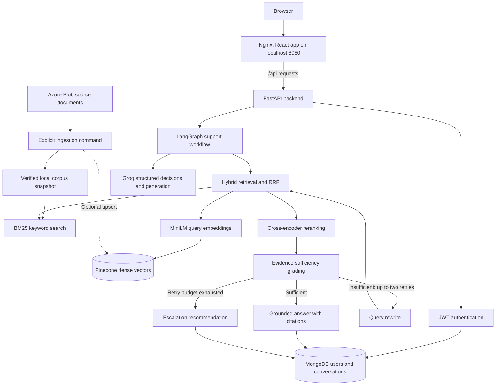
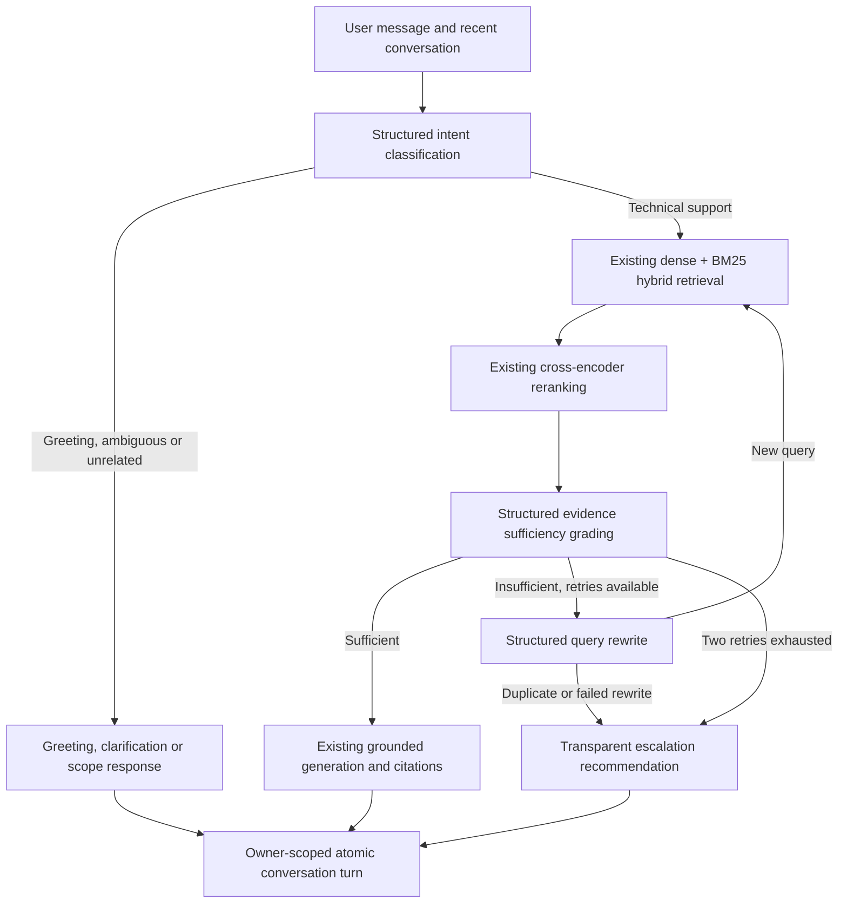

# NexaDesk AI Technical Support Resolution Assistant

Technical support teams often search across product documentation, known issues,
release notes, and historical tickets to resolve a single incident. Relevant
information can be scattered across formats, and a plausible answer without
supporting evidence can lead to incorrect troubleshooting steps.

NexaDesk AI brings that knowledge into an authenticated conversational workspace.
Its LangGraph Agentic RAG workflow combines keyword and semantic retrieval,
reranks the evidence, and checks whether it supports an answer. When evidence is
insufficient, the workflow can rewrite the search query within a fixed retry
budget; otherwise, it requests clarification or recommends escalation. Answers
include numbered citations that users can inspect in the React interface.

**Project status:** Completed portfolio project, successfully tested locally using
Docker. The application has **not been publicly deployed**. This status reflects
the project's reported local validation; automated tests use mocked services and
are described separately below. Escalation recommends further support; it does
not create a support ticket.

## Key Features

- **LangGraph Agentic RAG:** Structured intent routing and evidence grading guide retrieval, generation, clarification, and escalation.
- **Hybrid retrieval:** BM25 keyword search and Pinecone dense vector search are combined using reciprocal rank fusion (RRF).
- **Cross-encoder reranking:** Retrieved candidates are reordered with `cross-encoder/ms-marco-MiniLM-L-6-v2` before generation.
- **Bounded query rewriting:** At most two rewritten searches follow the original search, with duplicate-query detection and a graph recursion limit.
- **Grounded answers with citations:** Generation uses retrieved evidence and validates source identifiers; the UI exposes source metadata.
- **JWT authentication:** Registration, login, bearer tokens, and Argon2 password hashing protect access.
- **MongoDB conversation history:** Owner-scoped conversations support atomic turns, pagination, and follow-up questions.
- **React frontend:** A responsive TypeScript chat workspace provides light/dark themes, Markdown answers, citation dialogs, and saved conversations.

## Architecture



Azure ingestion runs explicitly, outside the request path. On first chat, the
backend verifies that the local corpus matches Pinecone before initializing
shared retrieval resources. MongoDB must be reachable at application startup;
the health endpoint does not prove that the RAG providers are ready.

## Technology Stack

| Layer | Technologies |
|---|---|
| Backend | Python 3.11, FastAPI, Uvicorn, Pydantic / pydantic-settings |
| Agent orchestration and LLM | LangGraph, LangChain Core, LangChain Groq, Groq (`llama-3.3-70b-versatile` by default) |
| Retrieval and ranking | Pinecone, rank-bm25, SentenceTransformers, PyTorch; `all-MiniLM-L6-v2` embeddings (384 dimensions), MiniLM cross-encoder |
| Knowledge ingestion | Azure Blob Storage, PyMuPDF, python-docx; TXT, Markdown, JSON, CSV, PDF, DOCX loaders |
| Persistence and security | MongoDB via async PyMongo, PyJWT, pwdlib / Argon2 |
| Frontend | React 19, TypeScript, Vite 6.4, Tailwind CSS 4, React Router, TanStack Query, Radix primitives, React Hook Form, Zod |
| Local container setup | Docker Compose, Python 3.11 slim backend image, Node 20 build stage, Nginx frontend image |
| Verification | pytest / pytest-asyncio, Vitest / Testing Library, Playwright, ESLint, Prettier |

Exact direct backend pins are in `backend/requirements.txt`; frontend dependency
ranges and resolved versions are in `frontend/package.json` and
`frontend/package-lock.json`. The existing Traditional RAG function remains
available alongside the agentic workflow.

## Quick Start (recommended: Docker Compose)

### Prerequisites

Install Docker with the Compose plugin and start its engine. You also need a
reachable MongoDB instance, Groq credentials, and an existing 384-dimensional
Pinecone index whose `nexadesk-kb` namespace matches the checked-in corpus.
Azure settings are required by configuration; Azure access is used when running
explicit ingestion. Compose runs the backend and frontend only; it does not
provision MongoDB, Azure, Pinecone, or Groq.

### Environment setup

From the repository root, copy the backend template **only if `backend/.env` does
not already exist**:

```sh
cp backend/.env.example backend/.env
```

PowerShell equivalent:

```powershell
Copy-Item backend/.env.example backend/.env
```

Edit `backend/.env` locally using the template's variable names:

| Variables | Required setup |
|---|---|
| `MONGODB_URI` | URI reachable from the backend container; use your MongoDB service's connection string. |
| `JWT_SECRET_KEY`, `JWT_ALGORITHM` | Replace the placeholder with a long random signing secret; the default algorithm is `HS256`. |
| `PINECONE_API_KEY`, `PINECONE_INDEX_NAME` | Credentials and name for your existing index; its corpus must pass the verification described below. |
| `GROQ_API_KEY`, `GROQ_MODEL` | Your Groq key and available model; the template supplies the default model name. |
| `AZURE_STORAGE_CONNECTION_STRING`, `AZURE_STORAGE_CONTAINER_NAME` | Your Azure source configuration for explicit corpus ingestion. |
| `APP_NAME`, `APP_VERSION`, `ENVIRONMENT` | Application metadata; retain template defaults for local use as appropriate. |

The template's `mongodb://localhost:27017` addresses the **backend container**
when used with Docker, so it must be changed for an external database. With
Docker Desktop and MongoDB running on the host, a typical local URI is
`mongodb://host.docker.internal:27017`, provided MongoDB accepts connections from
Docker. On other setups, use a host address reachable from the container;
`host.docker.internal` is not assumed to exist on every platform.

Keep `.env` files private and never commit actual credentials. Do not place
backend secrets in frontend configuration. Optional RAG settings and defaults
are documented in [Configuration and dependencies](#configuration-and-dependencies).

`frontend/.env.example` documents the public frontend and Vite development proxy
settings. For manual frontend development, optionally copy it to
`frontend/.env.local`. The supplied Docker build excludes `.env.*` files and uses
the frontend's built-in `/api` and `300000` ms defaults; copying that template
does not override the container build. Nginx already proxies `/api/` to FastAPI.

### Build, run, and open the application

```sh
docker compose up --build -d
docker compose ps
```

Open **[http://localhost:8080](http://localhost:8080)**, register an account, then
sign in. The backend API documentation is available at
[http://localhost:8000/docs](http://localhost:8000/docs), and its health endpoint
at [http://localhost:8000/health](http://localhost:8000/health).

Compose binds both ports to the local loopback interface and starts the frontend
after the backend health check passes. The first chat may take longer while
embedding and reranking models download and load; internet access is needed for
uncached model files and provider requests. Docker rebuilds use the existing
pinned dependencies, including the CPU-only PyTorch pin in `backend/Dockerfile`.

```sh
# Inspect startup or request failures.
docker compose logs --tail=100 backend frontend
# Stop and remove the application containers.
docker compose down
```

MongoDB data lives in the separately configured database. The Compose file does
not define persistent model-cache volumes, so recreating the backend container
may require downloading models again. A healthy API with a failing first chat
usually warrants checking Pinecone corpus alignment, provider configuration, and
model availability.

## Screenshots

Actual application screenshots will be added here. These are placeholders, not
rendered screenshots or evidence of functionality.

| Application view | Placeholder |
|---|---|
| Registration / sign-in | Pending actual local application screenshot |
| Chat workspace with a grounded answer | Pending actual local application screenshot |
| Source citation dialog | Pending actual local application screenshot |
| Saved conversation and dark theme | Pending actual local application screenshot |
| Responsive mobile workspace | Pending actual local application screenshot |

## Run the backend

For development outside Docker, use Python 3.11 and a virtual environment of
your choice. Configure `backend/.env` as described above, with a MongoDB URI
reachable from your host. From the repository root:

```sh
python -m venv .venv
# Activate on macOS/Linux:
source .venv/bin/activate
# On Windows PowerShell, use instead:
# .\.venv\Scripts\Activate.ps1
python -m pip install -r backend/requirements.txt
python -m pip check
cd backend
python -m uvicorn app.main:app --reload
```

The backend Dockerfile separately pins CPU-only PyTorch; manual installation
uses SentenceTransformers' dependency resolution unless you install an
appropriate PyTorch build yourself. For an existing compatible environment,
activate it and check dependencies before installing requirements.

Open `http://localhost:8000/docs`. Existing routes are `GET /health`,
`POST /auth/register`, `POST /auth/login`, and `GET /auth/me`.
Authentication still uses the existing bearer JWT and current-user dependency.

MongoDB must be reachable at startup. A compound conversation owner/update-time
index is created using the existing `technical_support_db` connection. ML models,
Pinecone verification, BM25, and the graph initialize lazily in a worker on first
chat, once per process. This avoids making authentication startup depend on
model downloads or Pinecone availability. First chat can be slow while models load.
Use one API worker initially: multiple workers each hold their own ML models.

## Backend structure

```text
backend/
├── .env.example
├── requirements.txt
├── requirements-test.txt
├── pytest.ini
├── app/
│   ├── main.py
│   ├── core/                 # Existing configuration, security, dependencies, logs
│   ├── db/                   # Existing async MongoDB connection
│   ├── routers/
│   │   ├── auth.py           # Existing registration/login/me
│   │   └── rag.py            # Chat and conversation endpoints
│   ├── schemas/
│   │   ├── user.py
│   │   └── rag.py
│   ├── services/
│   │   ├── auth_service.py
│   │   ├── agentic_rag_service.py
│   │   ├── conversation_service.py
│   │   └── rag_resources.py
│   └── rag/
│       ├── agentic/
│       │   ├── state.py
│       │   ├── nodes.py
│       │   ├── graph.py
│       │   └── policies.py
│       ├── corpus.py
│       ├── ingestion/        # Existing components plus build_corpus.py
│       ├── embeddings/       # Existing components
│       ├── vectorstore/      # Existing components
│       ├── retrieval/        # Existing components
│       ├── generation/       # Existing pipeline; shared, bounded Groq client
│       └── evaluation/       # Existing metrics and generation reference questions
├── notebooks/
│   └── retrieval_evaluation_data.json
└── tests/
    ├── conftest.py
    ├── fakes.py
    ├── test_agentic.py
    ├── test_api.py
    └── test_resources_and_traditional.py
```

## Agentic workflow



Intent, evidence and rewrite outputs use Pydantic schemas through Groq structured
function calling. Failed intent classification requests clarification. Failed
evidence grading never permits generation. Document similarity is not treated as
proof of correctness. Generation retains the existing context builder, grounded
prompt and numbered sources; missing/unknown citation identifiers are rejected.
Citation existence does not independently prove factual support for every claim.

At most three retrieval attempts occur: the original search and two rewritten
searches. Previously attempted queries are compared after case/whitespace/basic
terminal punctuation normalization. A failed/duplicate rewrite terminates.
A recursion limit provides an additional graph execution bound.

The latest three conversation turns, bounded in length, are provided only for
intent/reference resolution. Generation receives a standalone question and retrieved
documents, not historical answers as evidence. History is untrusted and cannot
replace the knowledge-base prompt. This is basic conversational context, not a
durable LangGraph checkpoint system. Raw graph state and grading reasoning are
not stored or exposed. Existing LLM evaluation helpers remain available offline.

## Canonical knowledge corpus

The checked-in `backend/notebooks/retrieval_evaluation_data.json` contains 43
persisted text/metadata chunks and is the default BM25 snapshot. Its evaluation
queries are ignored by initialization. Every chunk ID is checked against the
existing chunker's deterministic identity algorithm.

Before serving RAG, initialization verifies the Pinecone index dimension (384),
the `nexadesk-kb` namespace count, and every chunk's ID, text and citation metadata.
The snapshot is authoritative only when it passes this verification. A mismatch
returns a sanitized HTTP 503; there is no empty-corpus or dense-only fallback.
No Azure download or vector upsert occurs during API startup or chat initialization.

If the Pinecone knowledge base has changed, generate a matching full snapshot
using the existing ingestion components. From `backend/`:

```powershell
python -m app.rag.ingestion.build_corpus --output data/kb_chunks.json
```

This explicit command downloads supported Azure blobs, loads/cleans/chunks them,
validates IDs and writes a versioned JSON snapshot atomically. It does not change
Pinecone. Set `RAG_CORPUS_PATH=data/kb_chunks.json` and restart the backend.
The generated data directory is gitignored because it can contain support data.

Only when intentionally updating the existing knowledge base:

```powershell
python -m app.rag.ingestion.build_corpus --output data/kb_chunks.json --upsert
```

This upserts embeddings into the existing namespace. It never deletes stale
vectors or creates an index. If old vectors remain after source changes, reconcile
the namespace separately before chat initialization can pass its exact membership
check. Pinecone changes may require time to become visible. Back up an existing
snapshot before intentionally replacing it. The original PDF and DOCX loaders use
text extraction; scanned PDFs and DOCX tables do not gain OCR/table support here.

## Chat and conversations

All new endpoints require `Authorization: Bearer <access_token>`.

| Endpoint | Behavior |
|---|---|
| `POST /rag/chat` | Create a conversation or append to an owned conversation |
| `GET /rag/conversations?limit=20&offset=0` | List only the authenticated user's conversations |
| `GET /rag/conversations/{id}?limit=20&offset=0` | Read owned history, paginated by turns |

Obtain a token from the existing JSON login endpoint:

```json
{"email": "user@example.com", "password": "your-password"}
```

First chat request:

```json
{"message": "How do I fix NX-AUTH-4017?"}
```

Illustrative answered response (actual answer, sources and IDs depend on retrieval):

```json
{
  "answer": "Synchronize the application host time and follow the documented resolution [Source 1].",
  "sources": [{
    "citation": "[Source 1]",
    "source": "faq/known_issues.json",
    "chunk_id": "967f29f71425e2767a41f5a1ab68a7b1e0e0573964d559f79bebb20ce0177970",
    "ticket_id": null
  }],
  "conversation_id": "d30a769e-2338-49d7-aea4-2b019d8e46cf",
  "status": "answered",
  "escalation_recommended": false,
  "escalation_reason": null
}
```

Follow-up request uses the returned ID:

```json
{"message": "What should I check after that?", "conversation_id": "d30a769e-2338-49d7-aea4-2b019d8e46cf"}
```

Workflow statuses are `answered`, `clarification`, `greeting`, `out_of_scope`, and
`escalated`. Insufficient evidence produces an escalation recommendation and safe
reason; it explicitly says no ticket was created.

Conversation ownership uses the authenticated MongoDB user ID, never a user ID
supplied in the request. Both nonexistent and foreign conversations return 404.
Successful user/assistant messages are saved as one atomic turn. Optimistic
turn-count checks prevent concurrent writes from silently mixing histories (409).
History/list pagination is bounded; conversations are limited to 100 turns to keep
embedded MongoDB documents bounded. Start a new conversation at that limit.
Failed workflow requests can leave an empty newly created conversation; failed
turns are not recorded as successful responses.

Invalid messages/UUIDs return 422. Missing/invalid/expired bearer tokens follow
the existing auth behavior (401 or the bearer scheme's missing-token response).
Initialization, retrieval, ranking, generation or MongoDB failures return safe 503
responses. Logs exclude provider exception bodies and message content. Local
inference is serialized; a second simultaneous chat request receives 503 with a
retry hint rather than creating an unbounded inference queue. Other routes remain
responsive because blocking RAG work runs in a worker thread.

## Configuration and dependencies

`backend/requirements.txt` is the canonical dependency file; root `requirements.txt`
delegates to it. LangGraph is added and the existing LangChain/Groq dependencies
are pinned in the canonical requirements file. Test requirements
are pinned separately. No checkpoint database or additional LLM service is
required. These direct dependency pins are not a complete transitive lockfile.
Use an isolated environment for reproducible local development and avoid
unrelated dependency upgrades.

Existing settings remain intact. New optional variables are documented in
`backend/.env.example`:

| Variable | Default |
|---|---|
| `GROQ_TIMEOUT_SECONDS` | `30` (one SDK retry per call) |
| `RAG_CORPUS_PATH` | `notebooks/retrieval_evaluation_data.json` |
| `RAG_RETRIEVAL_K` | `10` |
| `RAG_CANDIDATE_K` | `10` |
| `RAG_FINAL_K` | `5` |
| `RAG_INITIALIZATION_RETRY_SECONDS` | `60` |
| `CONVERSATION_HISTORY_TURNS` | `3` |

The invariant is `1 <= final_k <= retrieval_k <= candidate_k <= 100`.
The new graph passes `candidate_k` explicitly, avoiding the existing Traditional
pipeline's implicit candidate limit. That pipeline remains unchanged and supports
its existing defaults; setting its `retrieval_k > 10` still exceeds its default
hybrid candidate limit.

The shared Groq client is cached and has bounded timeouts/retries. After a failed
resource initialization, retries are held off for 60 seconds; configuration/corpus
corrections can take effect on a later initialization attempt (restart for changed
environment values). No new keys are required. Existing authentication has no
tenant/RBAC isolation and the knowledge base remains a shared NexaDesk corpus;
conversation ownership does not create per-tenant document authorization.

## Verification

From the repository root, with your Python 3.11 environment activated:

```powershell
python -m pip install -r backend/requirements-test.txt
python -B -m pip check
python -B -m pytest -c backend/pytest.ini backend/tests -q
```

Tests mock external services and model calls. They cover intent routes, validated
decisions, hybrid/reranking/generation reuse, bounded retries, duplicate rewrites,
clarification/escalation, provider failures, bearer authentication, conversation
ownership/history/conflicts, resource reuse/recovery, snapshot validation, and
Traditional RAG compatibility. Test settings explicitly replace service credentials
with dummy values. No live Azure/Pinecone/Groq/MongoDB connection is required.

Previously reported backend verification: **54 tests passed**. The current test
source defines **54 cases**, including parametrization. Earlier local checks also
reported a clean `pip check`, valid deterministic IDs for all 43 corpus chunks,
a real BM25 search, backend/model/loader imports, structured-output adapter
construction without network calls, and Python syntax checks. These are recorded
validation results, not a fresh test execution during this documentation review.
External calls and model inference remain separate live-service checks; the mocked
suite does not establish Azure/Pinecone/Groq/MongoDB connectivity.

## Run the frontend

Keep the backend running using the manual development commands above. With
Node.js satisfying `frontend/package.json` (`>=20.18.0`) and npm available, open
a second terminal from the repository root:

```sh
cd frontend
npm ci
# Optional: copy .env.example to .env.local if you need to change its defaults.
npm run dev
```

Open `http://127.0.0.1:5173`. Register an account or sign in with an existing
backend account. Registration returns to sign-in; the backend does not issue a
token on registration. No demo account or mock mode is bundled into the app.

The lockfile was installed and verified with Node **20.18.0** and npm **10.8.2**.
Vite 6.4 and the TypeScript ESLint tooling are compatible with that baseline.
Check toolchain Node requirements before upgrading dependencies. Frontend
installation does not use or modify a Python environment.

### Frontend environment

`frontend/.env.example` contains public configuration only:

| Variable | Default | Purpose |
|---|---|---|
| `VITE_API_BASE_URL` | `/api` | Browser API base URL |
| `VITE_CHAT_TIMEOUT_MS` | `300000` | Timeout for normal HTTP chat responses, including first model initialization |
| `API_PROXY_TARGET` | `http://127.0.0.1:8000` | Development-server proxy target; not exposed as a Vite browser variable |

The Vite development server forwards `/api/*` to the existing backend and strips
the `/api` prefix. Browser requests therefore use the same origin. This setup
works without a separate frontend CORS configuration.
Read/authentication requests have a 30-second timeout. Restart Vite after changing
environment configuration. `VITE_*` values are public and embedded at build time:
never put backend keys, passwords, database credentials, or JWT signing secrets
in them.

### Frontend architecture

```text
frontend/
  src/
    app.tsx                    # Router, protected routes, query provider
    auth/auth-context.tsx      # Session verification, expiration and logout
    theme/theme-context.tsx    # Light, dark and system preference
    lib/
      contracts.ts             # Zod contracts derived from backend schemas
      api.ts                   # Fetch client, bearer headers, cancellation, safe errors
      session.ts               # Tab-scoped token storage and expiration helpers
      utils.ts                 # Styling and timestamp helpers
    pages/
      auth-page.tsx            # Login and registration with RHF/Zod validation
      chat-page.tsx            # New chat, stored history and continuation
    components/
      app-shell.tsx            # Sidebar, paginated conversations, mobile drawer, profile
      composer.tsx             # Multiline input and processing state
      chat-message.tsx         # Safe Markdown, code, citations, status and escalation
      welcome.tsx              # Empty state and editable suggested questions
      ui/                      # Reusable shadcn-style components with Radix primitives
    test/                      # Isolated fixtures and test providers
  e2e/workspace.spec.ts         # Desktop and mobile browser checks
  components.json              # shadcn/ui configuration and aliases
  .env.example
  package.json
  package-lock.json
```

The UI uses React/TypeScript, React Router, TanStack Query, React Hook Form/Zod,
Tailwind CSS, Radix/shadcn-style components, Lucide icons, and React Markdown/GFM
with syntax highlighting. Inter is self-hosted. Shared theme tokens provide
neutral surfaces and restrained blue accents, visible focus states, reduced
motion support, and responsive layouts. Chat and Markdown dependencies are split
from the initial authentication view.

The chat workspace follows a ChatGPT-style layout: a fixed 272px desktop sidebar
collapses to a 76px rail, and mobile navigation opens in a drawer. The top bar
contains NexaDesk AI branding, theme controls and the authenticated account menu.
A centered welcome screen and an 880px maximum chat column share consistent
spacing with the bottom composer. User messages align right, assistant responses
align left, and only the history area scrolls. Light/dark themes use restrained
blue accents; the composer respects mobile safe-area insets.

Project branding is extracted from `frontend/public/nexadesk-branding.png` into
`frontend/public/branding/nexadesk-logo.png` (horizontal, 1912x536) and
`nexadesk-icon.png` (square, 544x544). The assets have real PNG alpha transparency.
Authentication and desktop headers use the horizontal logo; compact/mobile
navigation, welcome graphics and assistant avatars use the standalone icon.
32px/64px favicons and a 180px touch icon are derived from the same icon.
The original shapes, typography and interior colors are retained; no CSS filters
recolor the artwork. Light backing surfaces keep the navy detail visible in dark
themes. The source file is retained.

The supplied PNG has a baked-in neutral checkerboard. The optional Windows
extraction script removes that matte and corrects its antialiased edge fringe,
copies artwork at native resolution, and resamples only the smaller browser
icons. It uses Windows System.Drawing and does not require new Python packages.
The generated assets are checked in; this script is not needed to run the app:

```powershell
# From frontend/, regenerate derived branding assets only.
./scripts/extract-branding.ps1
```

The API integration uses the backend's JSON login body and bearer token, verifies
the user through `/auth/me`, and preserves conversation IDs returned by
`/rag/chat`. Conversation lists load 20 at a time; search filters currently loaded
items. History requests 100 turns, matching the backend's current 100-turn limit,
and continues the selected conversation. Change history loading if that backend
limit is increased. Server timestamps are displayed in local time; newly returned
chat messages temporarily use the receipt time until stored history is fetched.

The frontend renders complete HTTP answers with a processing indicator; it does
not simulate streaming. Returned statuses and escalation reasons are displayed.
Source dialogs show exactly the returned citation, source filename, chunk ID and
ticket ID, without invented document URLs or previews. Escalation does not create
a support ticket. Conversation deletion and renaming are absent because the
backend does not expose those operations.

### Session and reliability behavior

Tokens live in `sessionStorage`, with a memory fallback if storage is unavailable.
They survive reload in the same tab and are not persisted in `localStorage`.
JavaScript can access this storage, so an XSS vulnerability could still expose a
token. `/auth/me` verifies a stored session; decoded JWT expiration only schedules
client-side logout. Protected API 401/403 responses clear the session and user
query cache and lead to sign-in. Invalid login credentials stay on the login form.
There is no refresh-token flow or server-side token revocation endpoint: logout
clears the local session, while an already copied token remains valid until expiry.
Backend authentication and conversation ownership remain authoritative.

Generated Markdown does not render raw HTML or automatically load remote images.
Unsafe link schemes are disabled, and external links use `noopener noreferrer`.
Requests carry no provider secrets; errors do not display raw internal exception
details, and the frontend does not log tokens or credentials.

Reads support cancellation; leaving a chat cancels its browser request. This does
not guarantee server-side inference stops. Failed chat submissions keep the draft
and can be retried explicitly. There are no automatic chat POST retries. If a
request times out or loses its connection, refresh history before resending:
the backend may have completed the turn, and there is no idempotency endpoint.
A new conversation whose response was lost can be found through the list refresh.

### Frontend verification

From `frontend/`:

```powershell
npm run typecheck
npm run lint
npm run format:check
npm test
npm run build
npm run test:e2e
```

Unit tests use Vitest and Testing Library. Browser tests build the production app
and run it with Vite preview; Playwright uses installed Microsoft Edge on Windows.
On another operating system, install Playwright Chromium with
`npx playwright install chromium` before running browser tests. Screenshots and
browser reports are written to gitignored test output directories.

Tests cover authentication, validation, protected routing, expiration and logout,
chat requests and errors, conversation restoration, citation inspection,
Markdown safety, answer copying, escalation, theme persistence, keyboard behavior,
and desktop/tablet/mobile layout, including sidebar collapse and a fixed composer
while long history scrolls. Fixtures and intercepted API responses exist only in
tests. These checks do not call live MongoDB, Pinecone or Groq services.

Previously reported frontend verification: **30 unit tests passed** and **9 production-build
browser tests passed** on desktop/tablet/mobile Edge, including a 320px mobile
viewport. The current source defines 30 unit tests and three browser scenarios
across three Playwright projects (nine cases). These results were not rerun
during this documentation review. TypeScript, ESLint, formatting,
and the production build passed. The build emits harmless third-party Zod comment
annotation warnings; there are no oversized JavaScript chunk warnings.

For manual live verification, start both servers, sign in, ask a known technical
support question, inspect its returned sources, refresh and reopen the saved
conversation, and send a follow-up. Check an insufficient-evidence response and
session expiration with your real backend configuration. No live account was
created or live RAG request submitted as part of frontend automated testing.

### Production hosting

Public hosting has not been performed. The local Docker frontend already serves
the production build through Nginx with SPA fallback and a 300-second API read
timeout. The following notes describe requirements for a future public deployment.

`npm run build` writes static assets to `frontend/dist`. Serve those assets with
SPA fallback to `index.html` for routes such as `/app/conversations/{id}`. Configure
the hosting reverse proxy to forward `/api/*` to FastAPI with `/api` removed and
allow enough time for chat initialization/inference. The development proxy is
not included in the production build, and `vite preview` is a local smoke-test
server rather than a production host. Use HTTPS for the browser and API.

If deploying the frontend and backend on different origins, set the public API
base URL at build time and configure explicit trusted frontend origins in the
backend's CORS policy. That is a deployment-specific change and has not been
added here. Verify deep-link refresh, login, chat and history through the final
hosting proxy before publishing.

## Future Improvements

These are potential next steps, not implemented features:

- Public deployment with HTTPS, managed secrets, and deployment validation.
- Larger retrieval and answer-quality evaluation sets with regression reporting.
- Tenant-aware knowledge-base authorization and role-based access controls.
- Idempotent chat submissions and improved concurrency management.
- Support-ticket integration for actionable escalation, plus conversation renaming and deletion.
- OCR and table-aware ingestion for scanned PDFs and richer documents.
